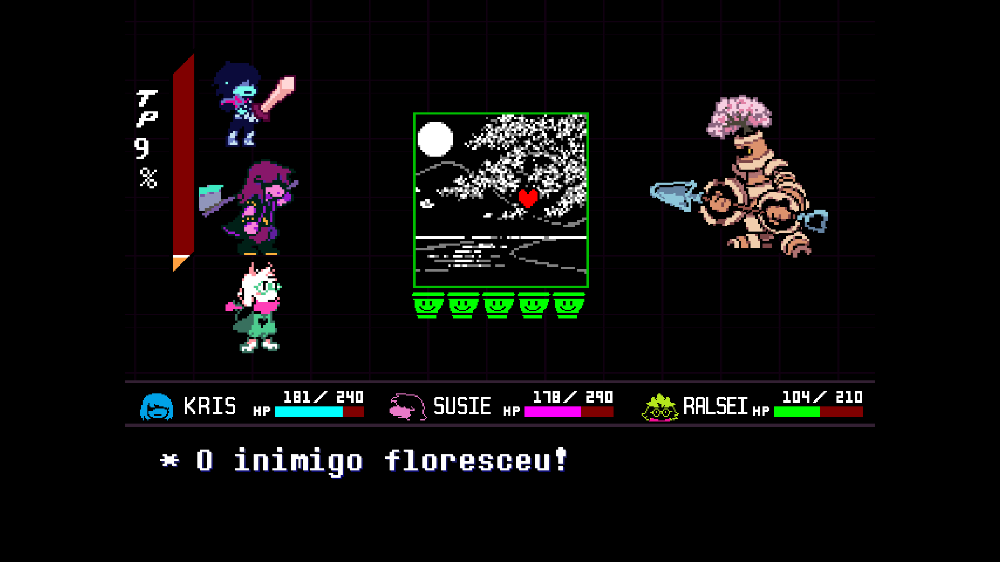
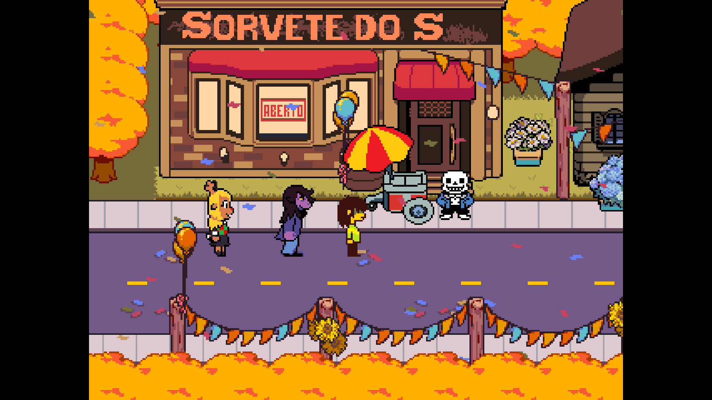

  <h1>Tradução PT-BR de DELTARUNE (por IA)</h1>
  
Uma tradução 'tapa-buraco' baseado na tradução do grupo <a href="https://github.com/teiarruma/deltarune-ptbr"><b>TEIARRUMA</b></a> de <a href="https://deltarune.com/"><b>DELTARUNE</b></a>, um jogo por Toby Fox.  

## Creditos maximo a TEIARRUMA
- Varios sprites foram retirado do projeto deles.

A tradução em si foi feita majoritariamente por IA manualmente para isso e revisada por humanos (vulgo, eu mesmo).

Graficos, Fontes etc. foram feitos manualmente por mim.

Ainda assim não é perfeita e está longe disto, mas pretendo ir atualizando até que a TEIARRUMA lance a tradução oficial deles.

## Usem os sprites, video e scripts como quiser.

## Caso a Equipe TEIARRUMA queira que o projeto ou seus trabalho seja retirado, entre em contato. Não tenho o intuito de substituir o trabalho deles.

Para instalar a tradução, siga as intruções da TEIARRUMA no [HÍPERLINK] acima.

> [!WARNING]  
> **Nota:** Projeto sem fins lucrativos, de fã para fã. Proibido qualquer tipo de comercialização com o projeto.

> [!WARNING]  
> **Nota²:** Verificador de Tradução PROVAVELMENTE será removido nos proximos updates.
